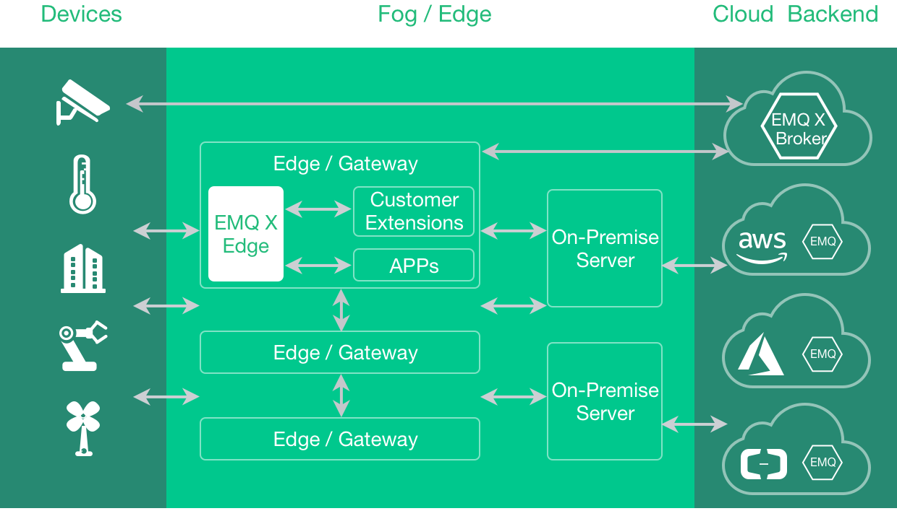

.. _getstarted:

===========
Get Started
===========

--------
Overview
--------

*EMQ X Edge* is an open source, lightweight MQTT broker running at any resource constraint edge devices. It's written in Erlang/OTP, and Erlang/OTP is a concurrent, fault-tolerant, soft-realtime and distributed programming platform. MQTT is an extremely lightweight publish/subscribe messaging protocol powering IoT, M2M and Mobile applications.

Highlights of the *EMQ X Edge Broker*:

* It supports MQTT, TCP, WebSocket and different industry protocols such ModBus.
* It can be running at different kinds of resource constrained edge devices, such as Raspberry Pi, gateway and industrial servers.
* It provides local data processing and cloud synchronization which will automatically synchronize data with cloud service based on network status.
* Integrated with EMQ X Storm which provides central monitoring and management services.

--------
Features
--------

* Lightweight - 20MB runtime memory with minimal resource consumption, which can run on ARM/x86 CPU, from Raspberry Pi to industrial X86 servers.
* Near real-time response - processing the data generated locally, so it can respond quickly to local events.
* Operate online or offline - it operate locally and can cache data when network is not available; when they’re back online it can synchronize data to the cloud and use the cloud for management, analysis and date persistence.
* Easy management & monitoring - central edge broker management, data synchronization, visualized monitoring tools based on web UI.
* Extensibility - Open APIs available to third party plugins to support more protocols, new functions and features.

-----------
Quick Start
-----------

Download and Install
--------------------

The *EMQ X Edge* is cross-platform, which could be deployed on Raspberry Pi, Linux and FreeBSD.

Download binary package from: http://emqx.io/downloads.

Installing on Linux, for example:

.. code-block:: bash

    unzip emqx-edge-centos7-v3.1.zip && cd emqx

    # Start EMQ X Edge
    ./bin/emqx start

    # Check Status
    ./bin/emqx_ctl status

    # Stop EMQ X
    ./bin/emqx stop

Installing from Source
----------------------

.. NOTE:: The *EMQ X Edge* broker requires Erlang/OTP R21+ to build since 3.0 release.

.. code-block:: bash

    git clone https://github.com/emqx/emqx.git

    cd emqx && make rel

    cd rel/emqx && ./bin/emqx console

-------
Plugins
-------

The *EMQ X Edge* broker could be extended by Plugins.  A plugin is an Erlang application that adds extra feature to the *EMQ X Edge* broker:

+-------------------------+--------------------------------------------+
| `emqx_retainer`_        | Store Retained Messages                    |
+-------------------------+--------------------------------------------+
| `emqx_auth_clientid`_   | Authentication with ClientId               |
+-------------------------+--------------------------------------------+
| `emqx_auth_username`_   | Authentication with Username and Password  |
+-------------------------+--------------------------------------------+
| `emqx_auth_http`_       | Authentication/ACL with HTTP API           |
+-------------------------+--------------------------------------------+
| `emqx_auth_mysql`_      | Authentication with MySQL                  |
+-------------------------+--------------------------------------------+
| `emqx_sn`_              | MQTT-SN Protocol Plugin                    |
+-------------------------+--------------------------------------------+
| `emqx_coap`_            | CoAP Protocol Plugin                       |
+-------------------------+--------------------------------------------+
| `emqx_stomp`_           | STOMP Protocol Plugin                      |
+-------------------------+--------------------------------------------+
| `emqx_recon`_           | Recon Plugin                               |
+-------------------------+--------------------------------------------+
| `emqx_reloader`_        | Reloader Plugin                            |
+-------------------------+--------------------------------------------+
| `emqx_web_hook`_        | Web Hook Plugin                            |
+-------------------------+--------------------------------------------+

A plugin could be enabled by 'bin/emqx_ctl plugins load' command.

For example, enable 'emqx_auth_mysql' plugin::

    ./bin/emqx_ctl plugins load emqx_auth_mysql

---------------------
MQTT Client Libraries
---------------------

GitHub: https://github.com/emqtt

+--------------------+----------------------+
| `emqttc`_          | Erlang MQTT Client   |
+--------------------+----------------------+
| `emqtt_benchmark`_ | MQTT benchmark Tool  |
+--------------------+----------------------+
| `CocoaMQTT`_       | Swift MQTT Client    |
+--------------------+----------------------+
| `QMQTT`_           | QT MQTT Client       |
+--------------------+----------------------+

Eclipse Paho: https://www.eclipse.org/paho/

MQTT.org: https://github.com/mqtt/mqtt.github.io/wiki/libraries

.. _emqttc:          https://github.com/emqtt/emqttc
.. _emqtt_benchmark: https://github.com/emqtt/emqtt_benchmark
.. _CocoaMQTT:       https://github.com/emqtt/CocoaMQTT
.. _QMQTT:           https://github.com/emqtt/qmqtt

.. _emqx_retainer:         https://github.com/emqx/emqx-retainer
.. _emqx_auth_clientid:    https://github.com/emqx/emqx-auth-clientid
.. _emqx_auth_username:    https://github.com/emqx/emqx-auth-username
.. _emqx_auth_http:        https://github.com/emqx/emqx-auth-http
.. _emqx_auth_mysql:       https://github.com/emqx/emqx-auth-mysql
.. _emqx_reloader:         https://github.com/emqx/emqx-reloader
.. _emqx_stomp:            https://github.com/emqx/emqx-stomp
.. _emqx_recon:            https://github.com/emqx/emqx-recon
.. _emqx_sn:               https://github.com/emqx/emqx-sn
.. _emqx_coap:             https://github.com/emqx/emqx-coap
.. _emqx_web_hook:         https://github.com/emqx/emqx-web-hook

