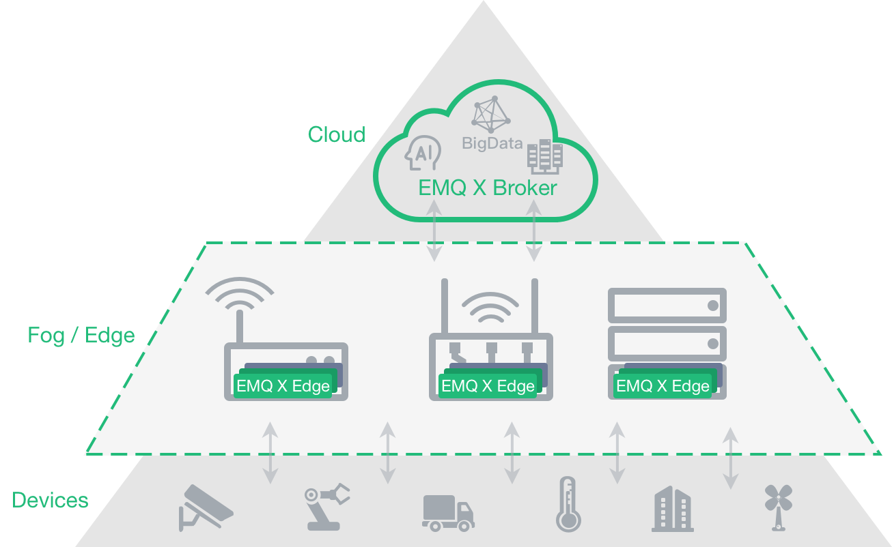

.. EMQ X Broker documentation master file, created by
   sphinx-quickstart on Mon Feb 22 00:46:47 2016.
   You can adapt this file completely to your liking, but it should at least
   contain the root `toctree` directive.

===============================
*EMQ X Edge* - a lightweight IoT Messaging Broker
===============================

*EMQ X Edge* is an open source, lightweight MQTT broker running at any resource constraint edge devices.

*EMQ X Edge* is fully open source and licensed under the Apache Version 2.0. *EMQ X* implements both MQTT V3.1/V3.1.1 and V5.0 protocol specifications, and supports MQTT, TCP, WebSocket and different industry protocols such ModBus.

*EMQ X Edge* can be running at different kinds of resource constrained edge devices, such as Raspberry Pi, gateway and industrial servers. And as the bridge between the local terminals and the remote broker, EMQ X Edge provides local data processing and cloud synchronization which will automatically synchronize data with cloud service based on network status.

Please visit [emqx.io](http://emqx.io) for more service. Follow us on Twitter: [@emqx](https://twitter.com/emqx)

+---------------+-----------------------------------------+
| Homepage:     | http://emqx.io                         |
+---------------+-----------------------------------------+
| Downloads:    | http://emqx.io/downloads               |
+---------------+-----------------------------------------+
| GitHub:       | https://github.com/emqx                |
+---------------+-----------------------------------------+
| Twitter:      | @emqx                                  |
+---------------+-----------------------------------------+
| Forum:        | https://groups.google.com/d/forum/emqx |
+---------------+-----------------------------------------+
| Mailing List: | emqx@googlegroups.com                  |
+---------------+-----------------------------------------+
| Contact:      | contact <contact@emqx.io>               |
+---------------+-----------------------------------------+

Contents:

.. toctree::
   :maxdepth: 2

   getstarted
   install
   config
   plugins

-------
License
-------

Apache License Version 2.0

